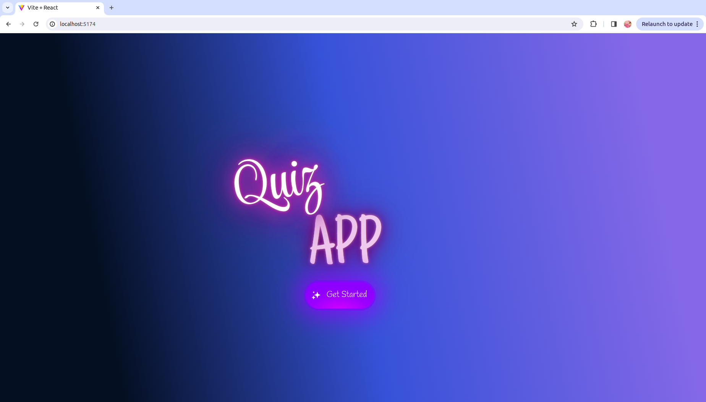

# Collaborative Quiz Game App 🚀

Welcome to the **Collaborative Quiz Game App** - an immersive quiz experience featuring three exciting categories! 🎉

## Description 📝

Test your knowledge across diverse domains with our engaging Quiz Game App! 🧠 Crafted using the dynamic trio of **React ⚛️, CSS 🎨, and JSX ✨**, this app provides an intuitive user interface for a delightful quiz experience.

Dive into thought-provoking questions from different categories and challenge yourself with:

- **General Knowledge** 🌍
- **Science** 🧪
- **Entertainment** 🎨

## Play Rules 🎮

1. Start the Game: Click on the "Start" button to begin the quiz.
2. Choose a Category: Start by selecting a category - General Knowledge (G.K.), Science, or Entertainment.
3. Answer Questions: Click on the correct answer to proceed to the next question.
4. Navigation: Your selection will take you directly to the next question.
5. End of Quiz: Once you've answered all questions, the app will display your quiz results.

## Deployment 🌐

Access the deployed website instantly! No installation required. Click on the image below to open the website:

## Collaboration 👥

This Quiz Game App is a collaborative masterpiece! 🤝 A big shoutout to these fantastic contributors:

- [Sadhana Singh](https://github.com/SadhanaSingh007) 👤

- [Yusra Ahmad](https://github.com/Yusra-Ahmad) 👤

- [Vasylyna Sidei](https://github.com/VasylynaSidei) 👤

## Technologies Used 🛠️

- **React ⚛️**: Crafting dynamic and responsive UI.
- **CSS 🎨**: Elevating the app's visual appeal with stylish design.
- **JSX ✨**: Creating expressive and efficient components.
- **HTML 🌐**: Providing the backbone for web content.
- **Vite 🚀**: Speeding up web development with efficiency.

## Contributing 🤝

Excited to contribute? Follow these steps:

1. Fork the repository.
2. Create a new branch: `git checkout -b feature/new-feature`
3. Commit your changes: `git commit -m 'Add new feature'`
4. Push to the branch: `git push origin feature/new-feature`
5. Open a pull request.

## 🚀 License

This Quiz Game App is open-source software licensed under the [MIT license](LICENSE).

Happy quizzing! 🧠🎉
